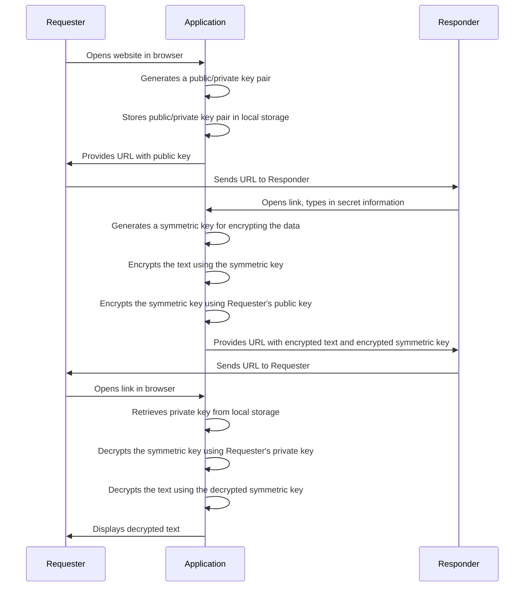

# Whispr

[Whispr](https://whispr.click) is a secure, privacy-focused web application that allows users to share private information with people of their choosing. The unique aspect of Whispr is that all data is securely encrypted and decrypted in the user's browser, ensuring that no sensitive information ever passes through a server.

## Security

Whispr uses a combination of symmetric and asymmetric encryption to secure data. The asymmetric encryption algorithm used is RSA-OAEP with a SHA-256 hash and a key modulus length of 2048. The symmetric encryption algorithm used is AES-GCM with a key length of 256.

When a user wants to share information, a symmetric key is generated for encrypting the data. This symmetric key is then encrypted with the recipient's public key. The recipient can decrypt the symmetric key using their private key and then use the symmetric key to decrypt the actual data.

All encryption and decryption operations are performed in the user's browser using the Web Cryptography API. This ensures that no unencrypted data or private keys ever leave the user's device.



## Inspiration

This project was inspired by [Retriever](https://retriever.corgea.io/index.html), a web application that allows users to share secrets securely. While Retriever provided a solid foundation, Whispr has made several improvements to their solution.

One of the key enhancements in Whispr is the use of asymmetric encryption, which allows for a larger text size that can be encrypted and sent. This ensures that users can share more complex and larger pieces of information securely.

We encourage you to check out [Retriever](https://retriever.corgea.io/index.html) and see the evolution of secure information sharing through Whispr.

## Running the Project Locally

To run this project locally, you will need Node.js and npm installed on your machine.

1. Install the dependencies:

```bash
npm install
```

2. Start a development server:

```bash
npm run dev

# or start the server and open the app in a new browser tab
npm run dev -- --open
```

## Contributing

Contributions to Whispr are welcome. Please fork the repository and create a pull request with your changes.  

## License
This project is licensed under the MIT License. See the LICENSE file for more details.
